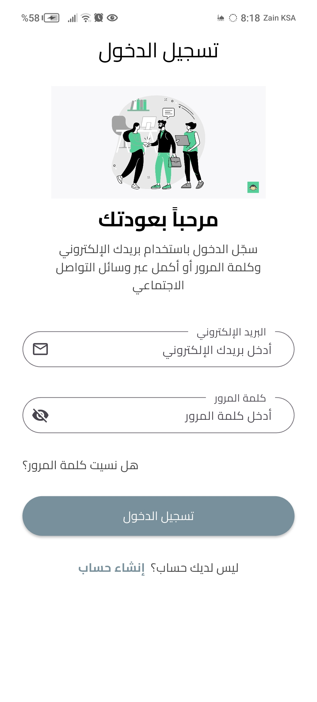
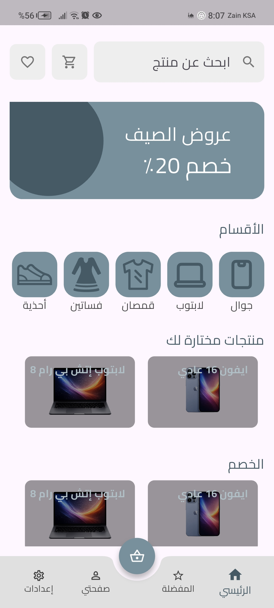
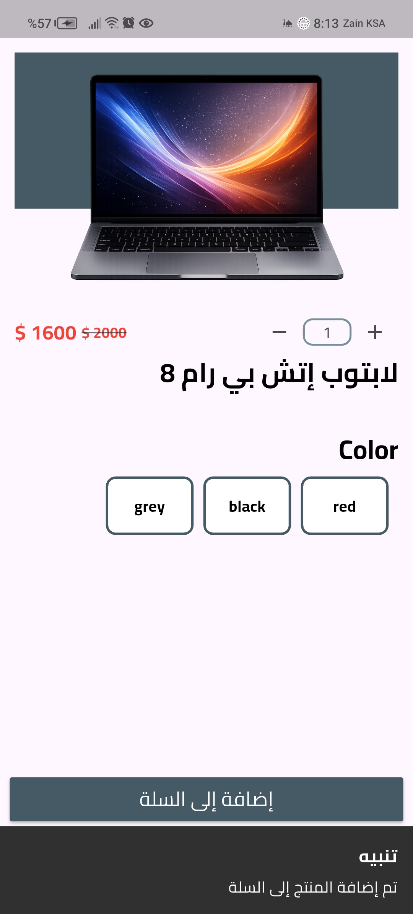
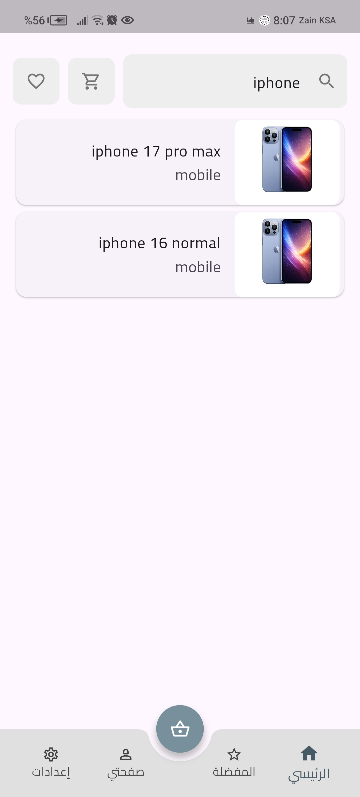
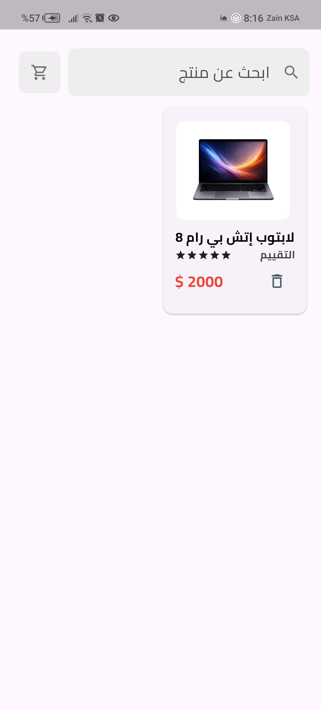
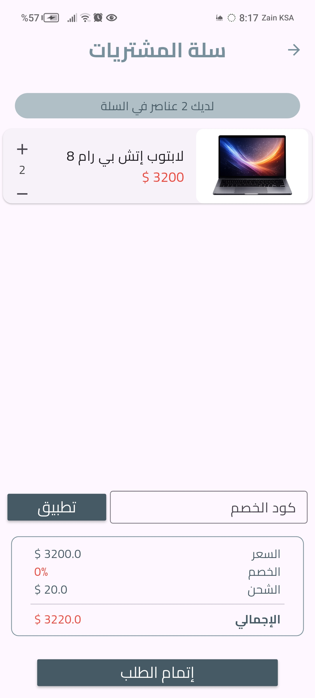
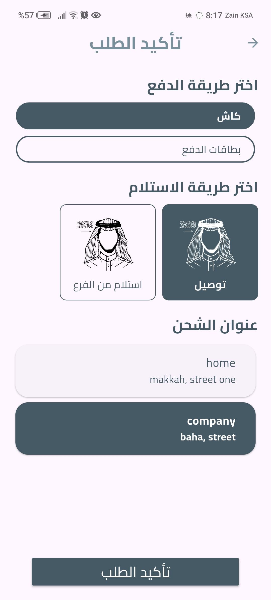
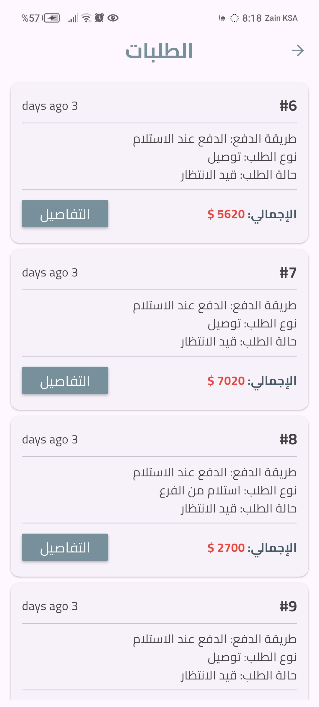
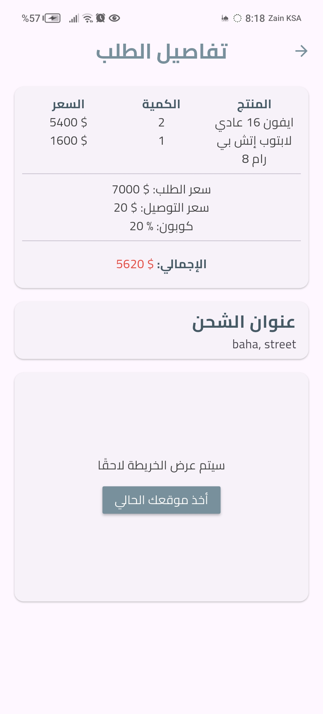

# 🛒 متجر إلكترونيات (Monorepo)

🇸🇦 العربية | 🇬🇧 [English](README.md)


**نظام متجر إلكتروني متكامل جاهز للإنتاج**، مبني بـ **Flutter** و **Laravel** — مستودع واحد (Monorepo) يحتوي على **ثلاثة تطبيقات موبايل منفصلة** (العميل، الأدمن، مندوب التوصيل) وكلها تتصل بـ **API واحد** مبني بـ Laravel، مدعوم بقاعدة بيانات MySQL.

يعتمد المشروع على بنية **Feature-based / Clean Architecture** في الواجهة الأمامية (باستخدام BLoC وFreezed)، وتصميم API مبني على الأدوار (`user`, `admin`, `delivery`) محمي بـ Laravel Sanctum.

📹 [فيديو العرض التوضيحي](https://youtube.com/shorts/fwH_YK5l2TU?si=tp8RQ-wFWWDCjjTd)

---

## جدول المحتويات

- [أبرز المميزات](#أبرز-المميزات)
- [التطبيقات داخل هذا المستودع](#التطبيقات-داخل-هذا-المستودع)
- [التقنيات المستخدمة](#التقنيات-المستخدمة)
- [هيكلة المشروع](#هيكلة-المشروع)
- [البنية المعمارية](#البنية-المعمارية)
- [الباك إند (Laravel API)](#الباك-إند-laravel-api)
- [تطبيقات الفرونت إند (Flutter)](#تطبيقات-الفرونت-إند-flutter)
- [الاختبارات](#الاختبارات)
- [صور من التطبيق](#صور-من-التطبيق)
- [العرض التوضيحي](#العرض-التوضيحي)
- [التثبيت](#التثبيت)
- [متغيرات البيئة](#متغيرات-البيئة)
- [أهداف المشروع](#أهداف-المشروع)
- [تحسينات مستقبلية](#تحسينات-مستقبلية)
- [الترخيص](#الترخيص)
- [المطوّر](#المطوّر)

---

## أبرز المميزات

- **3 تطبيقات فلاتر + API واحد** بلارافيل في مستودع واحد (عميل، أدمن، توصيل)
- بنية معمارية قائمة على المزايا (Feature-based) وClean Architecture في الواجهة
- إدارة الحالة عبر **BLoC** مع حالات وأحداث غير قابلة للتغيير باستخدام **Freezed**
- API مبني على الأدوار (`/user`, `/admin`, `/delivery`) محمي بـ **Laravel Sanctum**
- دورة طلب كاملة: العميل يطلب ← الأدمن يوافق ← مندوب التوصيل ينفذ
- إشعارات فورية عبر Firebase Cloud Messaging وFirestore
- خرائط جوجل وتحديد الموقع الجغرافي لاختيار العنوان والتوصيل
- تسجيل الدخول عبر جوجل
- دعم تعدد اللغات (خاصية `choose_language` في كل تطبيق)
- اختبارات Unit وBLoC (`bloc_test`, Mocktail, PHPUnit)

---

## التطبيقات داخل هذا المستودع

| التطبيق | المجلد | الوظيفة |
|---|---|---|
| 🛍️ **تطبيق العميل** | `frontend_user/` | تصفح المنتجات، البحث، المفضلة، السلة، إتمام الشراء، إدارة العناوين، تتبع الطلبات |
| 🛠️ **تطبيق الأدمن** | `frontend_admin/` | إدارة الأقسام والمنتجات، قبول/رفض الطلبات، عرض أرشيف الطلبات |
| 🚚 **تطبيق التوصيل** | `frontend_delivery/` | عرض الطلبات المسندة، قبولها، وتحديدها كمكتملة |
| ⚙️ **الباك إند** | `backend/` | واجهة برمجية (API) مبنية بـ Laravel 12 تخدم التطبيقات الثلاثة |

كل تطبيق هو مشروع Flutter مستقل (له `pubspec.yaml` واسم حزمة خاص به) ويتصل بنفس الباك إند — هذا يتيح بناء واختبار ونشر كل دور بشكل منفصل مع مشاركة نفس مصدر البيانات.

---

## التقنيات المستخدمة

| الواجهة الأمامية | الباك إند | قاعدة البيانات | خدمات |
|---|---|---|---|
| Flutter (Dart) | Laravel 12 (PHP 8.2+) | MySQL | Firebase (FCM, Firestore)، خرائط جوجل |

---

## هيكلة المشروع

```
electronics-store-monorepo/
├── backend/              # واجهة Laravel البرمجية
├── frontend_user/        # تطبيق العميل
├── frontend_admin/       # تطبيق لوحة تحكم الأدمن
└── frontend_delivery/    # تطبيق مندوب التوصيل
```

كل تطبيق من تطبيقات `frontend_*` يتبع نفس الهيكلة الداخلية:

```
lib/
├── core/            # أدوات مشتركة، ثوابت، تنسيق الواجهة، عميل الشبكة
├── data/            # مصادر البيانات والمستودعات (Repositories)
├── features/        # وحدات مبنية على المزايا (تفصيل بالأسفل)
├── widgets/         # عناصر واجهة مشتركة قابلة لإعادة الاستخدام
├── app_router.dart
├── app_translations.dart
├── api_endpoints.dart
└── main.dart
```

---

## البنية المعمارية

```
                  Firebase (FCM / Firestore)
                            │
                    إشعارات فورية
                            ▼
┌───────────────┐   ┌───────────────┐   ┌───────────────┐
│  تطبيق العميل  │   │  تطبيق الأدمن  │   │ تطبيق التوصيل  │
└───────┬───────┘   └───────┬───────┘   └───────┬───────┘
        │                   │                   │
        └────────────┬──────┴────────┬──────────┘
                      ▼
           واجهة REST API (Laravel, محمية بـ Sanctum)
                      │
                    MySQL
```

### طبقات الواجهة الأمامية (لكل تطبيق)

```
العرض (Presentation)
      │
منطق التطبيق (BLoC)
      │
  المستودع (Repository)
   ┌──┴──────┐
   │         │
مصدر بيانات   مصدر بيانات
عن بُعد       محلي
   │
REST API ← Laravel API
```

---

## الباك إند (Laravel API)

مبني بـ **Laravel 12** و**PHP 8.2+**، ويوفر API واحد تستهلكه التطبيقات الثلاثة، محمي بـ **Laravel Sanctum** (مصادقة عبر التوكن)، ومقسّم إلى ثلاث مجموعات مسارات: `/api/user`، `/api/admin`، `/api/delivery`.

### النماذج الأساسية (Models)
`User` · `Item` · `Category` · `Cart` · `Favorite` · `Address` · `Coupon` · `Order` · `Notification` · `Setting`

### أهم نقاط النهاية (Endpoints)

**العميل (User)**
| المجموعة | الوصف |
|---|---|
| المصادقة | تسجيل دخول / تسجيل حساب / دخول جوجل / استعادة كلمة المرور (عبر الإيميل ورمز التحقق) |
| الرئيسية | بيانات الصفحة الرئيسية للمتجر والعروض |
| المنتجات | عرض تفاصيل المنتج والبحث |
| المفضلة | إضافة / حذف / عرض المفضلة |
| السلة | إضافة، حذف، عرض، عدد العناصر |
| العناوين | إدارة عناوين الشحن (إضافة/تعديل/حذف/عرض) |
| الكوبونات | التحقق من كوبونات الخصم |
| الطلبات | إتمام الشراء، الطلبات المعلقة، الأرشيف، تفاصيل الطلب، التقييم |
| الإشعارات | عرض الإشعارات |

**الأدمن**
| المجموعة | الوصف |
|---|---|
| المصادقة | تسجيل دخول / خروج / استعادة كلمة المرور |
| الأقسام | إضافة / تعديل / حذف / عرض |
| المنتجات | إضافة / تعديل / حذف / عرض |
| الطلبات | عرض الطلبات المعلقة/المقبولة/المؤرشفة، الموافقة، الرفض |

**التوصيل**
| المجموعة | الوصف |
|---|---|
| المصادقة | تسجيل دخول / خروج / استعادة كلمة المرور |
| الطلبات | عرض الطلبات المعلقة/المقبولة/المؤرشفة، الموافقة، تحديدها كمكتملة |

جميع المسارات المحمية تتطلب توكن مصادقة عبر Sanctum (`auth:sanctum`).

### تقنيات الباك إند
- Laravel 12 + Sanctum
- Vite
- PHPUnit

---

## تطبيقات الفرونت إند (Flutter)

التطبيقات الثلاثة تشترك في نفس البنية المعمارية (Feature-based + BLoC + Freezed) وكثير من نفس الحزم، لكن كل تطبيق يعرض مزايا مختلفة حسب دوره.

### المزايا حسب التطبيق

| الميزة | العميل | الأدمن | التوصيل |
|---|:---:|:---:|:---:|
| شاشات التعريف بالتطبيق | ✅ | – | – |
| اختيار اللغة | ✅ | ✅ | ✅ |
| المصادقة (دخول/تسجيل/جوجل) | ✅ | ✅ | ✅ |
| الرئيسية | ✅ | ✅ | ✅ |
| تصفح المنتجات والبحث | ✅ | – | – |
| إدارة الأقسام والمنتجات | – | ✅ | – |
| المفضلة | ✅ | – | – |
| السلة وإتمام الشراء | ✅ | – | – |
| العناوين (خرائط + تحديد موقع) | ✅ | – | – |
| الطلبات (إنشاء/تتبع) | ✅ | – | – |
| الطلبات (موافقة/رفض) | – | ✅ | – |
| الطلبات (قبول/إتمام التوصيل) | – | – | ✅ |

### أهم الحزم المستخدمة (مشتركة بين التطبيقات)

**إدارة الحالة**
- `flutter_bloc`, `freezed`, `fpdart`

**الشبكة**
- `http`

**الخرائط والموقع**
- `google_maps_flutter`, `geolocator`, `geocoding`, `flutter_polyline_points`

**Firebase**
- `firebase_core`, `firebase_messaging`, `firebase_auth`, `cloud_firestore`, `flutter_local_notifications`

**التخزين المحلي**
- `sqflite`, `shared_preferences`, `flutter_secure_storage`

**الصور والواجهة**
- `cached_network_image`, `image_picker`, `flutter_svg`, `font_awesome_flutter`, `show_up_animation`, `auto_animated`, `device_preview`, `responsive_builder`

**QR / الباركود**
- `qr_flutter`, `mobile_scanner`

**المصادقة**
- `google_sign_in`

---

## الاختبارات

| الطبقة | الأداة |
|---|---|
| الباك إند | PHPUnit |
| BLoC / الحالة | `bloc_test` |
| المحاكاة (Mocking) | Mocktail |

---

## صور من التطبيق

الصور متوفرة داخل مجلد `assets/screenshots/` لكل تطبيق.

| تسجيل الدخول | الرئيسية | تفاصيل المنتج |
|---|---|---|
|  |  |  |

| البحث | المفضلة | السلة |
|---|---|---|
|  |  |  |

| إتمام الشراء | الطلبات | تفاصيل الطلب |
|---|---|---|
|  |  |  |

> ملاحظة: يُفضّل إضافة صور خاصة بتطبيقي الأدمن والتوصيل في `frontend_admin/assets/screenshots/` و`frontend_delivery/assets/screenshots/` لعرضهما بشكل صحيح — حالياً تستخدم نفس صور تطبيق العميل كصور مؤقتة.

---

## العرض التوضيحي

[](https://youtube.com/shorts/fwH_YK5l2TU?si=tp8RQ-wFWWDCjjTd)

---

## التثبيت

### الباك إند (Laravel)
```bash
cd backend
composer install
cp .env.example .env
php artisan key:generate
php artisan migrate
php artisan storage:link
php artisan serve
```

### تطبيق العميل
```bash
cd frontend_user
flutter pub get
flutter run
```

### تطبيق الأدمن
```bash
cd frontend_admin
flutter pub get
flutter run
```

### تطبيق التوصيل
```bash
cd frontend_delivery
flutter pub get
flutter run
```

> ملاحظة: وجّه رابط الـ API الأساسي في كل تطبيق (`api_endpoints.dart`) إلى الباك إند الخاص بك، واربط مشروع Firebase الخاص بك لكل تطبيق إذا رغبت بتفعيل الإشعارات الفورية.

---

## متغيرات البيئة

**الباك إند**
- `APP_KEY`
- `DB_DATABASE`
- `DB_USERNAME`
- `DB_PASSWORD`
- `MAIL_*`

**كل تطبيق فلاتر**
- رابط الـ API الأساسي
- مفتاح خرائط جوجل
- إعدادات Firebase (`google-services.json` / `GoogleService-Info.plist`)

---

## أهداف المشروع

بُني هذا المشروع لمحاكاة نظام متجر إلكتروني جاهز للإنتاج بأدوار متعددة، مع تطبيق ممارسات هندسة برمجيات حديثة ونظيفة على كامل دورة العملية التشغيلية — من شراء العميل، إلى موافقة الأدمن، إلى تنفيذ التوصيل.

الأهداف الرئيسية:
- بناء ثلاثة تطبيقات فلاتر قابلة للتوسع، كل منها مخصص لدور معين، من نفس البنية المعمارية
- تصميم API آمن مبني على الأدوار
- تطبيق Clean Architecture القائمة على المزايا بشكل متسق عبر التطبيقات
- فصل منطق العمل عن طبقة العرض باستخدام BLoC
- ممارسة تطوير موبايل متكامل (Full-stack) متعدد التطبيقات داخل مستودع واحد (Monorepo)

---

## تحسينات مستقبلية

- دمج بوابة دفع إلكتروني
- لوحة تحكم أدمن عبر الويب (بالإضافة لتطبيق الأدمن على الموبايل)
- خط أتمتة CI/CD
- دعم Docker
- تقييمات المنتجات
- الوضع الليلي (Dark Mode)
- تتبع مباشر للطلب على الخريطة (بين مندوب التوصيل والعميل)

---

## الترخيص

هذا المشروع مرخّص بموجب **رخصة MIT** — راجع ملف [LICENSE](LICENSE) للتفاصيل.

---

## المطوّر

**بدر عبدالله حجي**
مهندس برمجيات Flutter

- GitHub: [@BadrAbdu11ah](https://github.com/BadrAbdu11ah)
- الموقع الشخصي: [portfolio](https://tiny-sound-7e91.badrhaje2.workers.dev/)
- LinkedIn: [badrhaje](https://www.linkedin.com/in/badr-haje-21073a39b)
- الإيميل: Badrhaje2@gmail.com
