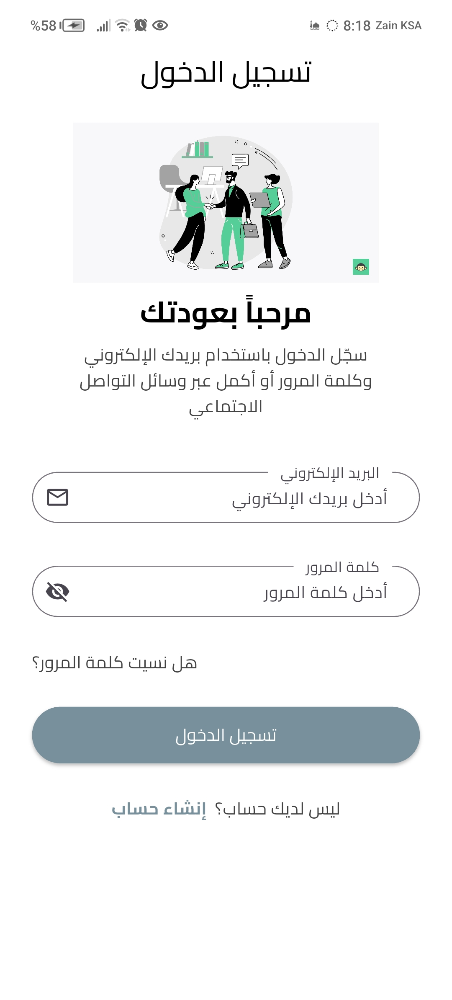
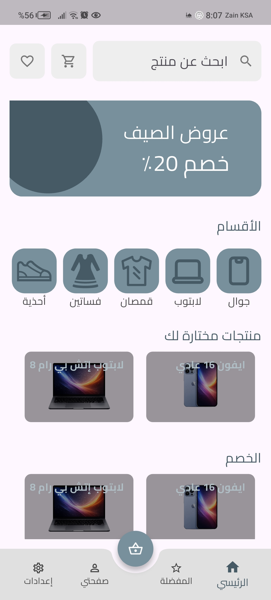
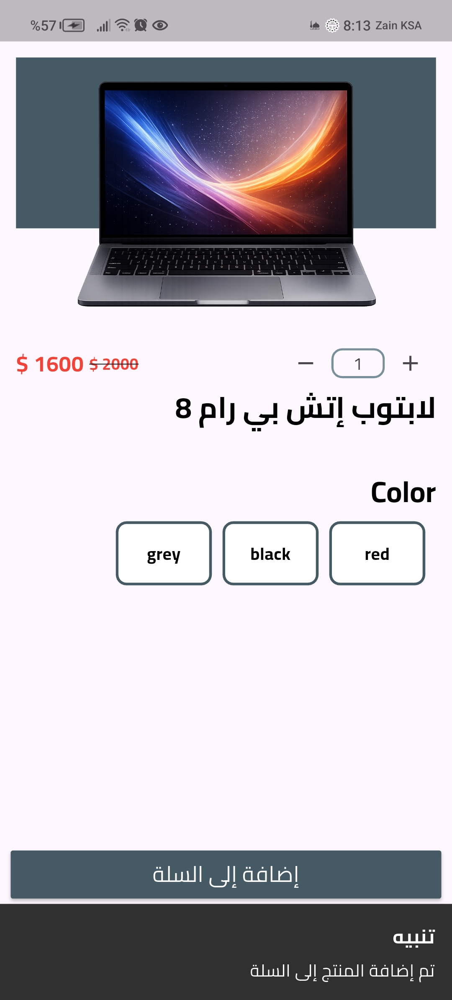
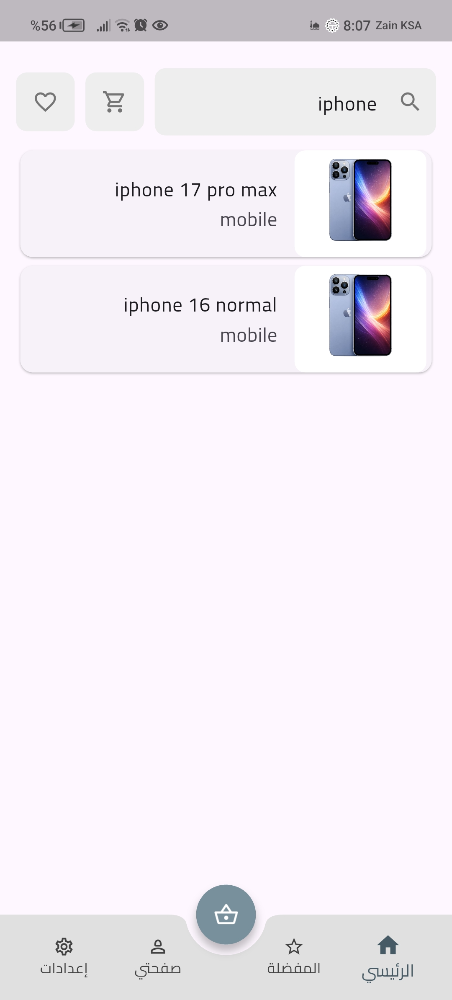
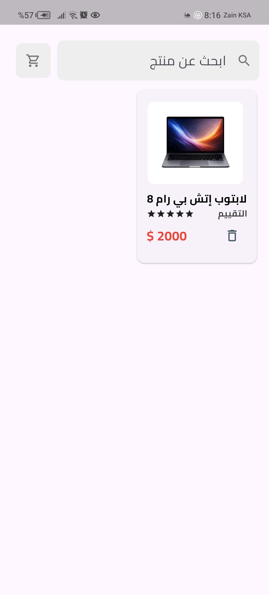
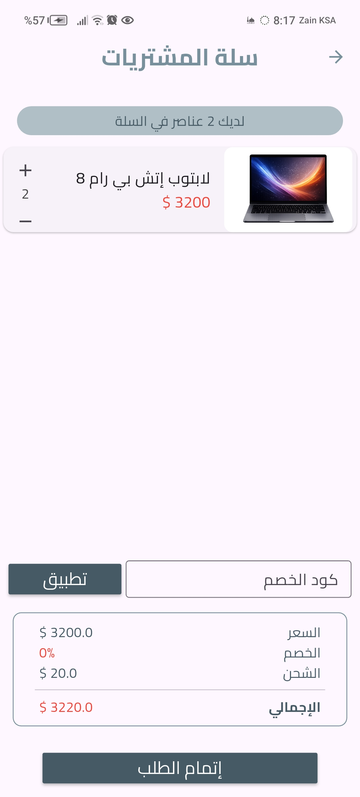
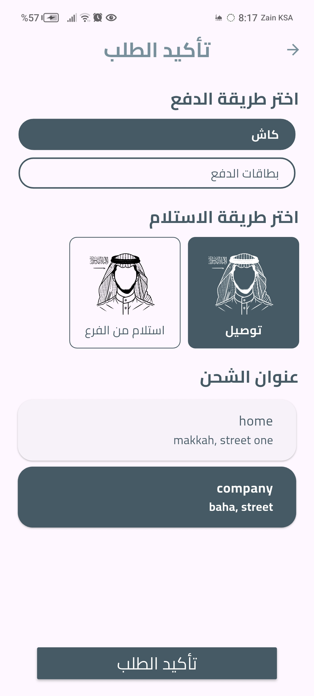
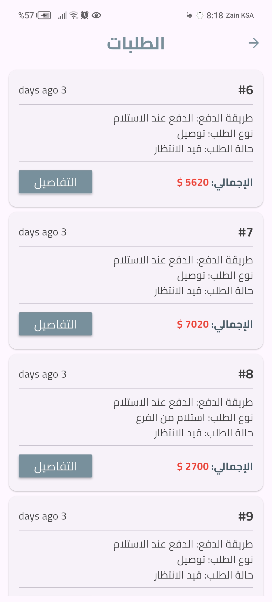
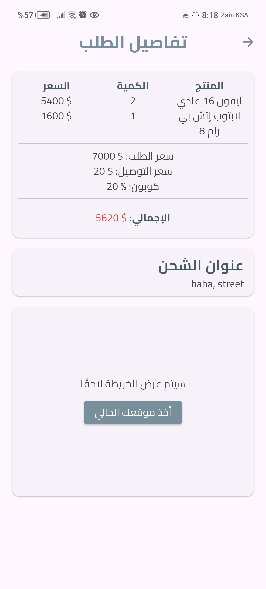

# 🛒 Electronics Store Monorepo

مستودع واحد (Monorepo) يجمع تطبيق متجر إلكتروني متكامل لبيع الأجهزة الإلكترونية، ويتكوّن من جزأين رئيسيين:

- **Backend**: واجهة برمجية (API) مبنية بـ **Laravel 12** (PHP)
- **Frontend**: تطبيق موبايل مبني بـ **Flutter** (Dart)

---

## 📁 هيكل المشروع

```
electronics-store-monorepo/
├── backend/     # Laravel API
└── frontend/    # Flutter Mobile App
```

---

## ⚙️ Backend (Laravel API)

مبني باستخدام **Laravel 12** و**PHP 8.2+**، ويوفر واجهة REST API متكاملة للتطبيق مع مصادقة عبر **Laravel Sanctum** (Token-based Auth).

### الموديلات (Models) الأساسية
- `User` — المستخدمون
- `Items` — المنتجات
- `Categories` — تصنيفات المنتجات
- `Cart` — سلة المشتريات
- `Favorite` — المفضلة
- `Address` — عناوين الشحن
- `Coupon` — كوبونات الخصم
- `Order` — الطلبات

### أبرز نقاط الـ API (Endpoints)
| المجموعة | الوظيفة |
|---|---|
| **Auth** | تسجيل دخول / إنشاء حساب / استعادة كلمة المرور (عبر التحقق بالإيميل والكود) |
| **Home** | الصفحة الرئيسية للمتجر |
| **Items** | عرض المنتجات والبحث فيها |
| **Favorite** | إضافة/حذف/عرض المفضلة |
| **Cart** | إدارة سلة المشتريات (إضافة، حذف، عرض، عدد العناصر) |
| **Address** | إدارة عناوين الشحن (CRUD) |
| **Coupon** | التحقق من صلاحية كوبونات الخصم |
| **Order** | إتمام الطلب (Checkout)، عرض الطلبات المعلّقة، وتفاصيل كل طلب |

جميع المسارات المحمية تتطلب توكن مصادقة عبر `auth:sanctum`.

### التقنيات المستخدمة
- Laravel 12 + Sanctum
- Vite لإدارة الأصول الأمامية للوحة التحكم (إن وجدت)
- PHPUnit للاختبارات

---

## 📱 Frontend (Flutter App)

تطبيق موبايل (Android / iOS) مبني بـ **Flutter**، بمعمارية مقسّمة حسب الميزات (Feature-based architecture).

### 🏗️ إدارة الحالة: BLoC + Freezed

يعتمد التطبيق بشكل أساسي على معمارية **BLoC** (`flutter_bloc`) لإدارة الحالة في كل ميزة تقريباً، بحيث تحتوي كل ميزة على مجلد `bloc/` يضم:
- `*_bloc.dart` — منطق الـ Bloc
- `*_event.dart` — الأحداث (Events)
- `*_state.dart` — الحالات (States)

ويتم توليد الـ **Events** والـ **States** باستخدام **Freezed** (`freezed` + `freezed_annotation`) لضمان:
- كلاسات غير قابلة للتغيير (Immutable) بشكل تلقائي
- دعم `copyWith` و`==`/`hashCode` جاهز بدون كتابة يدوية
- أنماط union/sealed classes لتمثيل حالات متعددة بشكل آمن (type-safe)

كما يستخدم المشروع `json_serializable` مع `build_runner` لتوليد كود التسلسل (Serialization) للموديلات، و`bloc_test` لاختبار الـ Blocs.

أمثلة على الميزات المطبَّقة بهذا النمط: `auth` (تسجيل الدخول، التسجيل، استعادة كلمة المرور بكل خطواتها)، `items_feature`، `on_boarding`، وغيرها — كل واحدة منها لها Bloc + Event + State مولّدة عبر Freezed.

لتوليد ملفات Freezed بعد أي تعديل على الموديلات:
```bash
flutter pub run build_runner build --delete-conflicting-outputs
```

### الميزات (Features)
- `on_boarding` — شاشات التعريف بالتطبيق
- `choose_language` — اختيار اللغة (دعم تعدد اللغات)
- `auth` — تسجيل الدخول وإنشاء الحساب (بما في ذلك تسجيل الدخول عبر Google)
- `home` — الصفحة الرئيسية
- `items_feature` — عرض تفاصيل المنتجات
- `search` — البحث عن المنتجات
- `favorite` — المفضلة
- `cart` — سلة المشتريات
- `address` — إدارة عناوين الشحن (مع دعم خرائط Google وتحديد الموقع)
- `check_out` — إتمام عملية الشراء
- `orders` — عرض الطلبات وتتبعها

### أهم المكتبات المستخدمة
- **إدارة الحالة**: `flutter_bloc` + `freezed` (راجع القسم أعلاه)
- **الخرائط والموقع**: `google_maps_flutter`, `geolocator`, `geocoding`, `flutter_polyline_points`
- **الإشعارات و Firebase**: `firebase_messaging`, `firebase_core`, `cloud_firestore`, `flutter_local_notifications`
- **التخزين المحلي**: `sqflite`, `shared_preferences`, `flutter_secure_storage`
- **الصور**: `cached_network_image`, `image_picker`
- **QR / Barcode**: `qr_flutter`, `mobile_scanner`
- **تسجيل الدخول عبر Google**: `google_sign_in`
- دعم تصميم متجاوب (`responsive_builder`) ومعاينة الأجهزة (`device_preview`)

---

## 🖼️ لقطات من التطبيق

يحتوي المشروع فعلياً على لقطات شاشة حقيقية داخل `frontend/assets/screenshots/`، إليك بعض شاشات التطبيق:

| تسجيل الدخول | الصفحة الرئيسية | تفاصيل المنتج |
|---|---|---|
|  |  |  |

| البحث | المفضلة | السلة |
|---|---|---|
|  |  |  |

| إتمام الشراء | الطلبات | تفاصيل الطلب |
|---|---|---|
|  |  |  |

> جميع الصور موجودة في مسار `frontend/assets/screenshots/` داخل المستودع.

## 🎥 فيديو توضيحي


> [](https://youtube.com/shorts/fwH_YK5l2TU?si=SSKMFRtKmyKs-clq)

---

## 🚀 التشغيل محلياً

### الباك اند (Laravel)
```bash
cd backend
composer install
cp .env.example .env
php artisan key:generate
php artisan migrate
php artisan serve
```

### الفرونت اند (Flutter)
```bash
cd frontend
flutter pub get
flutter run
```

> ملاحظة: يجب ضبط رابط الـ API الخاص بالباك اند داخل إعدادات الفرونت اند، وربط مشروع Firebase الخاص بك للإشعارات إن رغبت باستخدامها.

---

## 🧩 ملخص عام

المشروع عبارة عن **متجر إلكتروني كامل (E-commerce)** لبيع الأجهزة الإلكترونية، يشمل: تصفح المنتجات والتصنيفات، البحث، المفضلة، سلة المشتريات، الكوبونات، عناوين الشحن مع الخرائط، إتمام الطلبات ومتابعتها، مع نظام مصادقة كامل (تسجيل دخول، تسجيل حساب جديد، استعادة كلمة مرور، وتسجيل دخول عبر Google) وإشعارات فورية عبر Firebase.

من الناحية التقنية، يتميز التطبيق (الفرونت اند) باعتماده الكامل على **BLoC** مع **Freezed** لإدارة الحالة بشكل نظيف، غير قابل للتغيير (Immutable)، وآمن من ناحية الأنواع (Type-safe) في كل ميزة تقريباً.